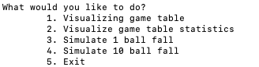
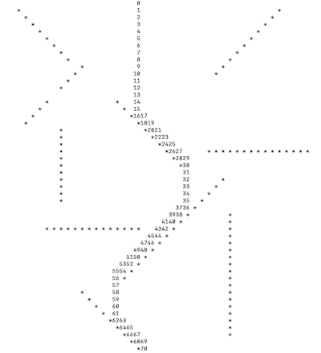

# Pinball

###### _Authors: macasal & sgalella_

We add our first own-written program. It was done during our first course in Programming and written in C.

It simulates the falling of a ball in a pinball. Four different available options:
1. Visualizing the game table
2. Print some statistics about the table
3. Simulating one ball falling and watching the route it takes in the table
4. Simulating ten balls fall and observing how many ball have gone through each position in the table


## Usage 

Compile running in command line:
```python
make
```

Run the program as:
```python
./bin/main
```


## Images

Menu option

<p align="center">
  
</p>

Example of simulation of a ball fall. The numbers indicate the trajectory of the ball.

<p align="center">
  
</p>
 

